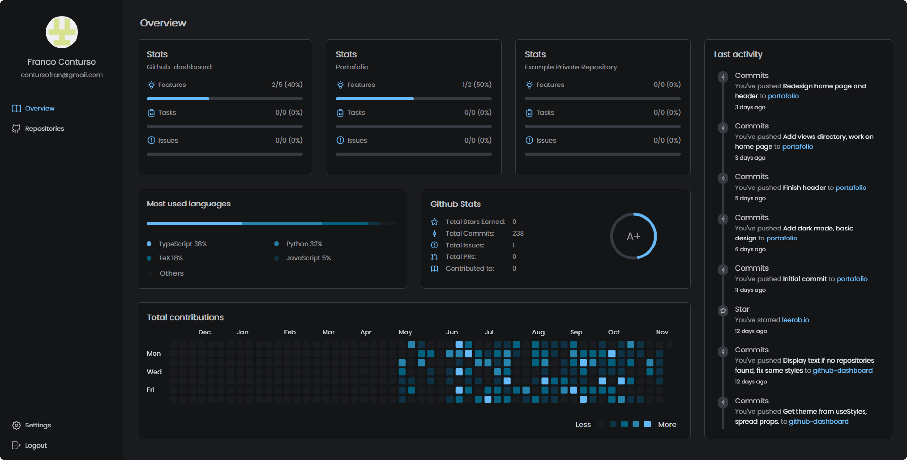
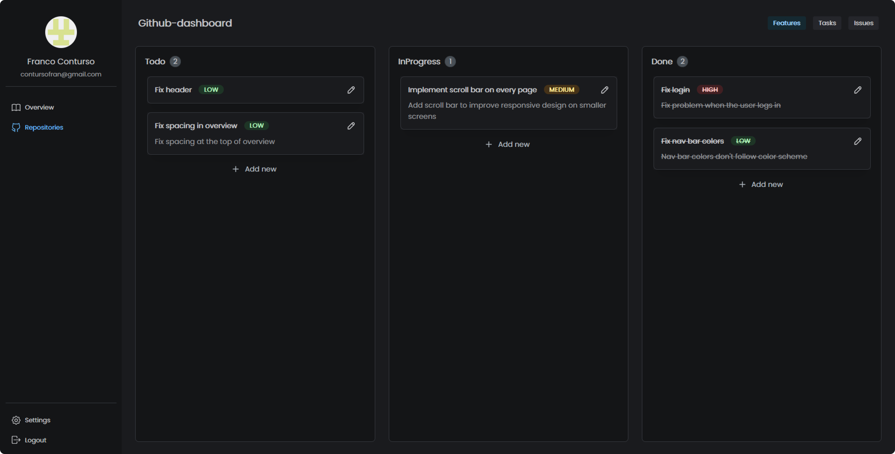

<a href="https://app.code-library.pub">
  
  <h1 align="center">Github Dashboard</h1>
</a>

  A web dashboard for visualizing your GitHub information and keeping track of your repositories.

## Introduction

This is a personal project built using the [T3 Stack](https://create.t3.gg/). Focused primarly on type safety.

### Tech Stack

- **Framework:** [Next.js](https://nextjs.org)
- **Styling:** [Tailwind CSS](https://tailwindcss.com)
- **User Management:** [NextAuth](https://next-auth.js.org/)
- **ORM:** [Prisma](https://prisma.io)
- **React Component Library:** [Mantine](https://mantine.dev/)
- **Database:** [Railway Postgres](https://railway.app/)
- **Deployment:** [Vercel](https://vercel.com/)

## Features

- Data Fetching, Caching and Mutation using **React Query**
- End-to-end typesafe APIs using **tRPC**
- Fetching github endpoints using **Github Octokit**
- Drag and drop cards made with **@hello-pangea/dnd**
- Validations using **Zod**
- State management using **Zustand**
- Notifications system using **Mantine/notifications**
- Written in **TypeScript**

## Screenshots

